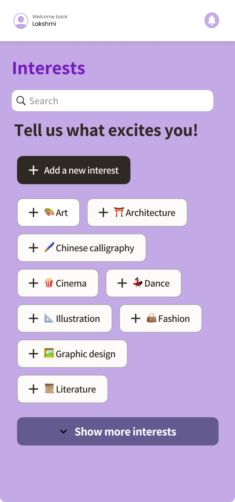
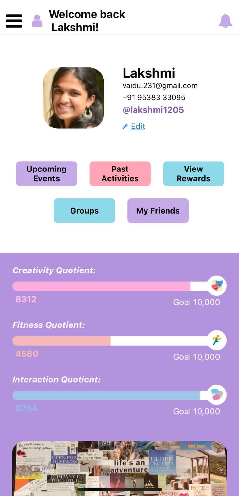
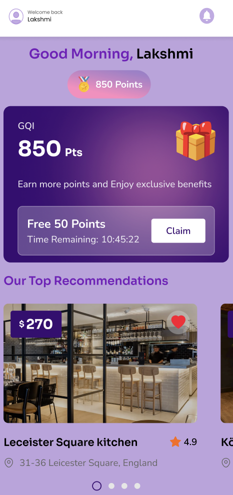
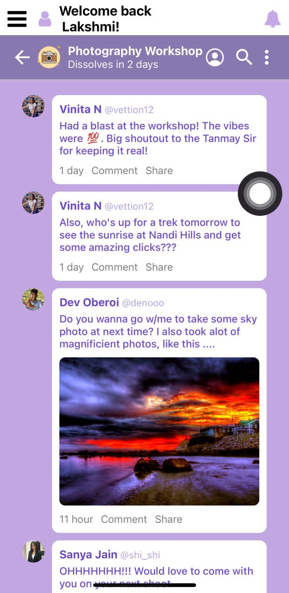

#   Xperios 

Welcome to **Xperios**, the ultimate app for curating enriching experiences that promote a well-balanced lifestyle. Move beyond social media and passive entertainment to actively engage in activities that foster personal growth and adventure!

## 📲 Features

### 🌟 Curated Experiences
From exciting events to thrilling adventures, we've got it all covered!
- Discover activities that boost creativity, fitness, and social interaction.
- Personalized recommendations based on your preferences and past activities.

### 📊 Novel Metrics Tracking
Unleash your best self with metrics that matter:
- **Creativity Quotient**: Engage in activities that spark your creativity.
- **Fitness Quotient**: Track your physical activities and stay fit.
- **Interaction Quotient**: Connect with people and engage in social interactions.

### 🏆 Balanced Score Rewards
Unlock metric rewards with every booked activity
- Maintain a balanced score across creativity, fitness, and interaction quotients.
- Earn rewards and unlock new experiences for a well-rounded lifestyle.

### 🗺️ Trip Planner
Discover local gems for a truly holistic adventure
- Get recommendations for destinations, activities, and itineraries.
- Discover local attractions, events, and hidden gems.
- Get real-time suggestions based on your location.

## 🛠️ Installation

To get started with Xperios, follow these steps:

1. Clone the repository:
   ```bash
   git clone https://github.com/siddarthpai/Xperios
   cd Xperios
   ```
2. Install dependencies:
   `npm install`
3. Start the Expo app:
   `npx expo start`

## 📸 Screenshots

#### Explore curated experiences tailored to your lifestyle.




#### Track your creativity, fitness, and interaction quotients.



#### Earn rewards by maintaining a balanced score across all metrics.



#### Your moments, our community. Share the joy, spread the love!




## 🚀 Usage

1. **Sign Up/In:** Create an account or log in to start your journey.
2. **Personalize:** Set your preferences and goals.
3. **Explore:** Discover activities and experiences curated just for you.
4. **Engage:** Participate in activities and track your progress.
5. **Earn:** Maintain a balanced score and earn exciting rewards.

## 🤝 Contributing

We welcome contributions to enhance Xperios! Please follow these steps:

1. Fork the repository.
2. Create a new branch (`git checkout -b feature/your-feature`).
3. Commit your changes (`git commit -m 'Add your feature'`).
4. Push to the branch (`git push origin feature/your-feature`).
5. Open a pull request.

## 📞 Contact

Have questions or feedback? Feel free to reach out!

Email: lakshmi@xperios.in/ deepika@xperios.in / siddarthdpai@gmail.com / papinenisaicharan@gmail.com

Instagram: @xperios.in

Website : https://www.xperios.in/
